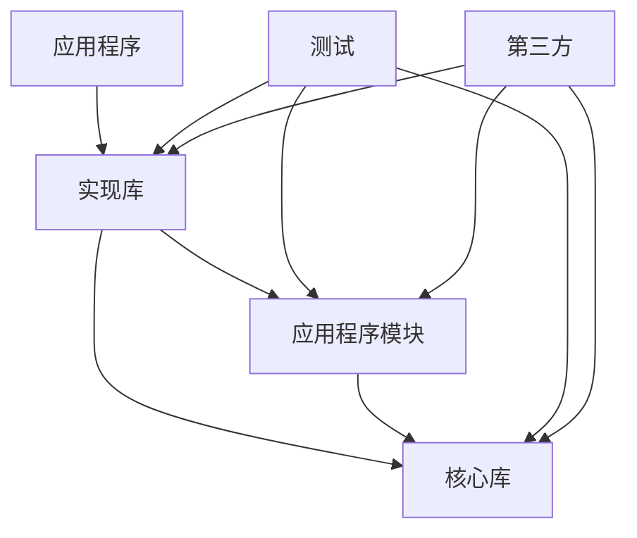

# 开发者指南

本指南为希望扩展、修改或贡献 cpp-template 项目的开发者提供全面的信息。它涵盖了项目架构、编码标准、构建系统详细信息和最佳实践。

## 目录

- [项目架构](#项目架构)
- [构建系统概述](#构建系统概述)
- [编码标准](#编码标准)
- [添加新组件](#添加新组件)
- [依赖管理](#依赖管理)
- [测试指南](#测试指南)
- [CMake 最佳实践](#cmake-最佳实践)
- [贡献指南](#贡献指南)

## 项目架构

### 目录结构理念

项目遵循分层结构，促进：

- **关注点分离**：不同类型代码之间的清晰边界
- **模块化**：组件可以独立开发和测试
- **可重用性**：库可以在多个应用程序中使用
- **可维护性**：易于定位和修改特定功能

```
cpp-template/
├── include/           # 公共 API 头文件（用户看到的）
├── src/              # 应用程序实现
│   └── modules/      # 模块化应用程序组件
├── libs/             # 内部项目库
│   └── core/         # 基础功能
├── tests/            # 所有测试代码
├── third_party/      # 外部依赖
├── cmake/            # 构建系统模块
└── scripts/          # 开发和构建脚本
```

### 组件关系



### 设计原则

1. **接口隔离**：`include/` 中的公共头文件定义清晰的 API
2. **依赖倒置**：高级模块不依赖于低级模块
3. **单一职责**：每个库/模块都有专注的目的
4. **开闭原则**：易于扩展而无需修改现有代码

## 构建系统概述

### CMake 架构

构建系统使用现代 CMake (3.20+) 和基于目标的配置：

- **顶级 CMakeLists.txt**：全局配置和项目设置
- **组件 CMakeLists.txt**：每个组件的本地配置
- **自定义模块**：`cmake/` 目录中的可重用 CMake 函数和工具
- **CMakePresets.json**：不同场景的预定义构建配置

### CMake 预设配置

项目使用 CMakePresets.json 进行标准化构建配置：

```bash
# 默认构建（无 vcpkg）
cmake --preset default
cmake --build build/default

# vcpkg 构建（Release）
cmake --preset vcpkg
cmake --build build/vcpkg

# vcpkg 调试构建
cmake --preset vcpkg-debug
cmake --build build/vcpkg-debug

# 带可选功能的 vcpkg
cmake --preset vcpkg-features
cmake --build build/vcpkg-features
```

### 使用的关键 CMake 概念

1. **基于目标的方法**：所有配置都附加到特定目标
2. **生成器表达式**：平台和配置特定的设置
3. **接口库**：仅头文件和依赖管理
4. **vcpkg 集成**：自动工具链检测和配置
5. **IPO/LTO**：Release 构建的链接时优化
6. **位置无关代码**：为安全性和兼容性全局启用

### 构建配置流程

1. **项目设置**：版本 (0.0.2)、C++17 标准、全局设置
2. **平台检测**：Windows、macOS（Intel/Apple Silicon）、Linux 配置
3. **vcpkg 集成**：自动工具链检测和三元组选择
4. **依赖解析**：通过 vcpkg 查找或下载所需库
5. **目标创建**：具有适当链接的库和可执行文件
6. **编译器优化**：Release 的 IPO/LTO，Debug 的调试符号
7. **测试设置**：Google Test 与 CTest 集成
8. **安装**：使用适当的导出目标打包分发

## 编码标准

### C++ 标准

- **语言版本**：C++17（通过 CMake 强制执行）
- **标准库**：在可能的情况下优先使用标准库而非第三方
- **现代特性**：使用 RAII、智能指针、基于范围的循环、auto
- **扩展**：禁用（CMAKE_CXX_EXTENSIONS OFF）

### 代码格式化 (.clang-format)

项目使用 clang-format，基于 Google 风格并进行自定义：

```bash
# 格式化单个文件
clang-format -i src/file.cpp

# 格式化所有源文件
find . -name "*.cpp" -o -name "*.hpp" -o -name "*.h" | xargs clang-format -i
```

**关键格式化规则：**
- **行长度**：100 个字符
- **缩进**：4 个空格（无制表符）
- **大括号风格**：附加（Google 风格）
- **指针对齐**：左对齐（`int* ptr`）
- **访问修饰符**：-2 缩进偏移
- **包含排序**：区分大小写，保留块

### 命名约定

```cpp
// 命名空间：小写带下划线
namespace cpp_template {
namespace core {

// 类：PascalCase
class DataProcessor {
public:
    // 公共方法：camelCase
    void processData();

    // 公共成员：camelCase（避免公共数据）
    int getCount() const;

private:
    // 私有成员：camelCase 带尾随下划线
    std::string data_;
    int count_;
};

// 函数：camelCase
void initializeSystem();

// 常量：UPPER_CASE
const int MAX_BUFFER_SIZE = 1024;

// 枚举：PascalCase 带 PascalCase 值
enum class ProcessingMode {
    Fast,
    Accurate,
    Balanced
};

} // namespace core
} // namespace cpp_template
```

### 文件组织

```cpp
// header_file.h
#pragma once

#include <system_headers>
#include <third_party/headers>
#include "project/headers.h"

namespace cpp_template {

class ExampleClass {
public:
    // 公共接口优先
    ExampleClass();
    ~ExampleClass();

    // 复制/移动操作
    ExampleClass(const ExampleClass&) = delete;
    ExampleClass& operator=(const ExampleClass&) = delete;
    ExampleClass(ExampleClass&&) = default;
    ExampleClass& operator=(ExampleClass&&) = default;

    // 主要功能
    void doSomething();

private:
    // 私有实现
    void helperFunction();

    // 数据成员最后
    std::unique_ptr<Implementation> impl_;
};

} // namespace cpp_template
```

### 文档标准

```cpp
/**
 * @brief 类或函数的简要描述
 *
 * 详细描述，解释目的、行为和用法。
 * 在有帮助时包含示例。
 *
 * @param parameter_name 参数描述
 * @return 返回值描述
 * @throws ExceptionType 何时抛出此异常
 *
 * @example
 * ```cpp
 * ExampleClass obj;
 * obj.doSomething();
 * ```
 */
void doSomething(int parameter_name);
```

## 添加新组件

### 添加新的内部库

1. **创建目录结构**：

   ```bash
   mkdir -p libs/newlib/{include/newlib,src}
   ```

2. **创建 CMakeLists.txt**：

   ```cmake
   # libs/newlib/CMakeLists.txt
   add_library(newlib STATIC)

   target_sources(newlib
       PRIVATE
           src/newlib.cpp
       PUBLIC
           include/newlib/newlib.h
   )

   target_include_directories(newlib
       PUBLIC
           $<BUILD_INTERFACE:${CMAKE_CURRENT_SOURCE_DIR}/include>
           $<INSTALL_INTERFACE:include>
       PRIVATE
           ${CMAKE_CURRENT_SOURCE_DIR}/src
   )

   target_link_libraries(newlib
       PUBLIC
           core  # 如果依赖于 core
   )

   # 应用编译器选项
   if(COMMAND apply_compiler_options)
       apply_compiler_options(newlib)
   endif()

   # 创建别名
   add_library(newlib::newlib ALIAS newlib)
   ```

3. **更新父 CMakeLists.txt**：

   ```cmake
   # libs/CMakeLists.txt
   add_subdirectory(core)
   add_subdirectory(newlib)  # 添加此行
   ```

4. **创建公共头文件**：

   ```cpp
   // libs/newlib/include/newlib/newlib.h
   #pragma once

   namespace cpp_template {
   namespace newlib {

   class NewLibrary {
   public:
       NewLibrary();
       ~NewLibrary();

       void doSomething();
   };

   } // namespace newlib
   } // namespace cpp_template
   ```

5. **创建实现**：

   ```cpp
   // libs/newlib/src/newlib.cpp
   #include "newlib/newlib.h"

   namespace cpp_template {
   namespace newlib {

   NewLibrary::NewLibrary() = default;
   NewLibrary::~NewLibrary() = default;

   void NewLibrary::doSomething() {
       // 实现
   }

   } // namespace newlib
   } // namespace cpp_template
   ```

### 添加新的应用程序模块

1. **创建模块文件**：

   ```bash
   touch src/modules/new_module.{h,cpp}
   ```

2. **更新模块 CMakeLists.txt**：

   ```cmake
   # src/modules/CMakeLists.txt
   add_library(new-module STATIC
       new_module.cpp
   )

   target_include_directories(new-module
       PUBLIC
           ${CMAKE_CURRENT_SOURCE_DIR}
           ${CMAKE_SOURCE_DIR}/include
       PRIVATE
           ${CMAKE_SOURCE_DIR}/libs/core/include
   )

   target_link_libraries(new-module
       PUBLIC
           core
   )
   ```

3. **在主应用程序中链接**：

   ```cmake
   # src/CMakeLists.txt
   target_link_libraries(cpp-template-app
       PRIVATE
           cpp-template-impl
           data-processor
           config-manager
           new-module  # 添加此行
   )
   ```

### 为新组件添加测试

1. **创建测试文件**：

   ```cpp
   // tests/unit/newlib_test.cpp
   #include <gtest/gtest.h>
   #include "newlib/newlib.h"

   namespace cpp_template {
   namespace newlib {
   namespace test {

   class NewLibraryTest : public ::testing::Test {
   protected:
       void SetUp() override {
           library_ = std::make_unique<NewLibrary>();
       }

       void TearDown() override {
           library_.reset();
       }

       std::unique_ptr<NewLibrary> library_;
   };

   TEST_F(NewLibraryTest, BasicFunctionality) {
       ASSERT_NO_THROW(library_->doSomething());
   }

   } // namespace test
   } // namespace newlib
   } // namespace cpp_template
   ```

2. **将测试添加到 CMakeLists.txt**：

   ```cmake
   # tests/unit/CMakeLists.txt
   add_cpp_template_test(newlib
       SOURCES newlib_test.cpp
       LIBRARIES newlib
   )
   ```

## 依赖管理

### 添加 vcpkg 依赖

项目使用 vcpkg 清单模式和 `vcpkg.json` 进行依赖管理。

**当前依赖：**
- `gtest`：测试框架
- `fmt`：字符串格式化库
- `nlohmann-json`：JSON 解析
- `cpprestsdk`：REST API 客户端（非 UWP 平台）

**可选功能：**
- `networking`：添加 curl 和 openssl
- `database`：添加 sqlite3 和 postgresql

1. **更新 vcpkg.json**：

   ```json
   {
     "dependencies": [
       "existing-dep",
       "new-dependency"
     ]
   }
   ```

2. **在 CMake 中使用**：

   ```cmake
   find_package(NewDependency CONFIG REQUIRED)
   target_link_libraries(your_target PRIVATE NewDependency::NewDependency)
   ```

3. **启用可选功能**：

   ```bash
   cmake --preset vcpkg-features
   # 或设置 VCPKG_MANIFEST_FEATURES="networking;database"
   ```

**版本覆盖：**
项目将 `fmt` 固定到版本 10.1.1 以保持稳定性。

### 添加系统依赖

1. **创建查找模块**（如果需要）：

   ```cmake
   # cmake/FindNewDep.cmake
   find_path(NEWDEP_INCLUDE_DIR newdep.h)
   find_library(NEWDEP_LIBRARY newdep)

   include(FindPackageHandleStandardArgs)
   find_package_handle_standard_args(NewDep
       REQUIRED_VARS NEWDEP_LIBRARY NEWDEP_INCLUDE_DIR
   )

   if(NewDep_FOUND AND NOT TARGET NewDep::NewDep)
       add_library(NewDep::NewDep UNKNOWN IMPORTED)
       set_target_properties(NewDep::NewDep PROPERTIES
           IMPORTED_LOCATION "${NEWDEP_LIBRARY}"
           INTERFACE_INCLUDE_DIRECTORIES "${NEWDEP_INCLUDE_DIR}"
       )
   endif()
   ```

2. **在项目中使用**：

   ```cmake
   find_package(NewDep REQUIRED)
   target_link_libraries(your_target PRIVATE NewDep::NewDep)
   ```

### 添加手动依赖

1. **创建目录结构**：

   ```bash
   mkdir -p third_party/manual/newdep/{include,src,lib}
   ```

2. **添加到手动 CMakeLists.txt**：

   ```cmake
   # third_party/manual/CMakeLists.txt
   check_manual_dependency("NewDep" "newdep" NEWDEP_AVAILABLE)
   if(NEWDEP_AVAILABLE)
       create_header_only_target(manual_newdep
           "${CMAKE_CURRENT_SOURCE_DIR}/newdep/include"
       )
       add_library(third_party::newdep ALIAS manual_newdep)
   endif()
   ```

## 测试指南

### 测试框架

项目使用 **Google Test** 并通过 CMake 自动发现：

- **框架**：Google Test (gtest) + Google Mock (gmock)
- **发现**：`gtest_discover_tests()` 用于自动测试注册
- **执行**：CTest 集成并行执行
- **配置**：4 个并行作业，5 分钟超时

### 运行测试

```bash
# 构建并运行所有测试
cmake --build build --target test

# 使用 CTest 运行测试
cd build && ctest

# 运行带详细输出的测试
cd build && ctest --verbose

# 运行特定测试
cd build && ctest -R "test_name"

# 并行运行测试
cd build && ctest -j4
```

### 测试类别

1. **单元测试**：独立测试单个类/函数
2. **集成测试**：测试组件交互
3. **性能测试**：关键功能基准测试
4. **系统测试**：端到端应用程序测试

### 测试组织

```
tests/
├── unit/           # 单个组件的单元测试
├── integration/    # 集成测试
├── performance/    # 性能基准测试
└── CMakeLists.txt  # 测试配置
```

### 测试结构

```cpp
#include <gtest/gtest.h>
#include <gmock/gmock.h>
#include "component_under_test.h"

namespace cpp_template {
namespace component {
namespace test {

// 共享设置/清理的测试夹具
class ComponentTest : public ::testing::Test {
protected:
    void SetUp() override {
        // 通用设置
    }

    void TearDown() override {
        // 通用清理
    }

    // 共享测试数据
    ComponentUnderTest component_;
};

// 基本功能测试
TEST_F(ComponentTest, BasicOperation) {
    // 准备
    auto input = createTestInput();

    // 执行
    auto result = component_.process(input);

    // 断言
    EXPECT_EQ(expected_result, result);
}

// 错误处理测试
TEST_F(ComponentTest, HandlesInvalidInput) {
    auto invalid_input = createInvalidInput();

    EXPECT_THROW(component_.process(invalid_input), std::invalid_argument);
}

// 多输入的参数化测试
class ComponentParameterizedTest : public ComponentTest,
                                  public ::testing::WithParamInterface<TestData> {
};

TEST_P(ComponentParameterizedTest, ProcessesVariousInputs) {
    auto test_data = GetParam();
    auto result = component_.process(test_data.input);
    EXPECT_EQ(test_data.expected_output, result);
}

INSTANTIATE_TEST_SUITE_P(
    VariousInputs,
    ComponentParameterizedTest,
    ::testing::Values(
        TestData{input1, output1},
        TestData{input2, output2}
    )
);

} // namespace test
} // namespace component
} // namespace cpp_template
```

### 模拟对象

```cpp
// 测试用的模拟接口
class MockDependency : public IDependency {
public:
    MOCK_METHOD(int, getValue, (), (override));
    MOCK_METHOD(void, setValue, (int value), (override));
    MOCK_METHOD(bool, isValid, (), (const, override));
};

// 在测试中使用模拟
TEST_F(ComponentTest, UsesMockDependency) {
    auto mock_dep = std::make_shared<MockDependency>();

    EXPECT_CALL(*mock_dep, getValue())
        .WillOnce(::testing::Return(42));

    component_.setDependency(mock_dep);
    auto result = component_.calculate();

    EXPECT_EQ(84, result);  // 假设 calculate() 将值加倍
}
```

## CMake 最佳实践

### 基于目标的配置

```cmake
# 好：基于目标的方法
add_library(mylib STATIC src/mylib.cpp)
target_include_directories(mylib PUBLIC include)
target_compile_features(mylib PUBLIC cxx_std_17)
target_link_libraries(mylib PUBLIC dependency::dependency)

# 避免：全局变量
# set(CMAKE_CXX_STANDARD 17)  # 影响所有目标
# include_directories(include)  # 全局包含
```

### 生成器表达式

```cmake
# 平台特定配置
target_compile_definitions(mylib PRIVATE
    $<$<PLATFORM_ID:Windows>:PLATFORM_WINDOWS=1>
    $<$<PLATFORM_ID:Linux>:PLATFORM_LINUX=1>
    $<$<PLATFORM_ID:Darwin>:PLATFORM_MACOS=1>
)

# 配置特定选项
target_compile_options(mylib PRIVATE
    $<$<CONFIG:Debug>:-g -O0>
    $<$<CONFIG:Release>:-O3 -DNDEBUG>
)

# 编译器特定标志
target_compile_options(mylib PRIVATE
    $<$<CXX_COMPILER_ID:GNU>:-Wall -Wextra>
    $<$<CXX_COMPILER_ID:MSVC>:/W4>
)
```

### 自定义函数

```cmake
# 一致目标配置的可重用函数
function(configure_cpp_target TARGET_NAME)
    target_compile_features(${TARGET_NAME} PUBLIC cxx_std_17)

    if(COMMAND apply_compiler_options)
        apply_compiler_options(${TARGET_NAME})
    endif()

    set_target_properties(${TARGET_NAME} PROPERTIES
        CXX_EXTENSIONS OFF
        POSITION_INDEPENDENT_CODE ON
    )
endfunction()

# 用法
add_library(mylib STATIC src/mylib.cpp)
configure_cpp_target(mylib)
```

## 贡献指南

### 开发工作流

1. **Fork 仓库**
2. **设置开发环境**：`./scripts/setup-dev-env.sh`
3. **创建功能分支**：`git checkout -b feature/new-feature`
4. **按照编码标准进行更改**
5. **格式化代码**：`clang-format -i modified_files.cpp`
6. **为新功能添加测试**
7. **构建和测试**：`cmake --preset vcpkg && cmake --build build/vcpkg --target test`
8. **检查代码质量**：确保 CI 检查通过
9. **根据需要更新文档**
10. **提交拉取请求**

### 开发环境设置

为您的平台使用提供的设置脚本：

```bash
# 自动设置（macOS、Ubuntu、Fedora、Arch）
./scripts/setup-dev-env.sh

# 手动 vcpkg 设置
export VCPKG_ROOT=/path/to/vcpkg
cmake --preset vcpkg
```

### 持续集成

项目使用 GitHub Actions 进行自动化质量检查：

**代码质量工作流**（`.github/workflows/code-quality.yml`）：
- **C++ 代码检查**：clang-format 和 clang-tidy 分析
- **CMake 格式化**：cmake-format 验证
- **静态分析**：cppcheck 集成
- **SARIF 上传**：安全分析结果
- **多平台**：Ubuntu 24.04 与 LLVM 17

**质量门槛：**
- 代码格式化合规性
- 静态分析警告
- 跨配置构建成功
- 测试执行和覆盖率

### 代码审查清单

**代码质量：**
- [ ] 代码遵循项目编码标准（.clang-format）
- [ ] 静态分析警告已解决（clang-tidy）
- [ ] 没有引入编译器警告
- [ ] 适当的错误处理和异常安全

**测试：**
- [ ] 所有新功能都有单元测试
- [ ] 测试在所有支持的平台上通过
- [ ] 测试覆盖率足够
- [ ] 为新功能添加了集成测试

**文档：**
- [ ] 公共 API 使用 Doxygen 注释记录
- [ ] 如需要更新 README.md
- [ ] 为新模式更新 DEVELOPER_GUIDE.md
- [ ] 更新 CHANGELOG.md

**构建系统：**
- [ ] CMake 配置正确
- [ ] 为新依赖更新 vcpkg.json
- [ ] 没有添加不必要的依赖
- [ ] 所有 CMake 预设都能正常构建

**性能和安全：**
- [ ] 考虑并测量性能影响
- [ ] 验证内存安全（RAII、智能指针）
- [ ] 没有引入安全漏洞

### 提交消息格式

项目遵循 [Conventional Commits](https://www.conventionalcommits.org/) 规范进行提交消息：

```
type(scope): 简要描述

变更的详细解释，包括：
- 更改了什么以及为什么
- 任何破坏性变更
- 对问题或工单的引用

Closes #123
```

**Conventional Commits 类型：**
- `feat`：用户的新功能
- `fix`：用户的错误修复
- `docs`：文档更改
- `style`：代码风格更改（格式化、缺少分号等）
- `refactor`：不改变功能的代码重构
- `test`：添加或更新测试
- `chore`：维护任务、依赖更新、构建更改
- `perf`：性能改进
- `ci`：CI/CD 配置更改
- `build`：构建系统或外部依赖的更改
- `revert`：回滚之前的提交

**破坏性变更：**
对于破坏性变更，在类型/范围后添加 `!`：`feat!: remove deprecated API`

**示例：**
```
feat(core): 添加数据验证模块
fix(build): 解决 vcpkg 依赖冲突
docs: 更新安装指南
style(format): 应用 clang-format 到所有源文件
refactor(utils): 简化字符串处理逻辑
test(core): 添加边界条件测试
chore(deps): 更新 vcpkg 依赖到最新版本
perf(algorithm): 优化排序算法性能
ci: 添加代码覆盖率报告
build: 更新 CMake 最低版本要求
revert: 回滚 "feat: 添加实验性功能"
```

### 发布流程

项目使用基于 GitHub Actions 的自动化发布流程：

#### 自动化发布工作流

发布通过推送符合语义化版本的 Git 标签自动触发：

```bash
# 创建新版本
git tag v1.2.3
git push origin v1.2.3
```

工作流将自动：
- 在多个平台构建项目（Ubuntu 24.04、Windows 2022、macOS 14）
- 生成各种包格式（TGZ、ZIP、DEB、RPM、DMG、NSIS）
- 运行质量保证检查
- 创建 GitHub 发布并附加构建产物
- 生成发布说明

#### 创建发布

1. **更新版本号**：
   ```bash
   # 更新 CMakeLists.txt 中的版本
   sed -i 's/VERSION [0-9]\+\.[0-9]\+\.[0-9]\+/VERSION 1.2.3/' CMakeLists.txt

   # 更新 vcpkg.json 中的版本
   sed -i 's/"version": "[0-9]\+\.[0-9]\+\.[0-9]\+"/"version": "1.2.3"/' vcpkg.json
   ```

2. **提交版本更改**：
   ```bash
   git add CMakeLists.txt vcpkg.json
   git commit -m "chore: bump version to 1.2.3"
   git push origin main
   ```

3. **创建并推送标签**：
   ```bash
   git tag -a v1.2.3 -m "Release version 1.2.3"
   git push origin v1.2.3
   ```

4. **监控工作流**：
   - 访问 GitHub Actions 页面监控构建进度
   - 检查所有平台构建是否成功
   - 验证包生成和上传

#### 发布工作流特性

**构建矩阵：**
- **Ubuntu 24.04**：生成 TGZ、DEB、RPM 包
- **Windows 2022**：生成 ZIP、NSIS 安装程序
- **macOS 14**：生成 TGZ、DMG 包

**质量保证：**
- 所有平台的完整构建和测试
- 静态分析和代码质量检查
- 包完整性验证

**发布说明：**
- 自动从提交历史生成
- 包含自上次发布以来的所有更改
- 按类型分组（功能、修复、文档等）

#### 版本管理

**语义化版本：**
- **主版本**（1.0.0）：破坏性 API 更改
- **次版本**（0.1.0）：向后兼容的新功能
- **补丁版本**（0.0.1）：向后兼容的错误修复

**预发布版本：**
```bash
# Alpha 版本
git tag v1.2.3-alpha.1

# Beta 版本
git tag v1.2.3-beta.1

# 发布候选
git tag v1.2.3-rc.1
```

#### 热修复流程

对于关键错误修复：

1. **从发布标签创建热修复分支**：
   ```bash
   git checkout v1.2.3
   git checkout -b hotfix/1.2.4
   ```

2. **应用修复并测试**：
   ```bash
   # 进行必要的更改
   git add .
   git commit -m "fix: critical security vulnerability"
   ```

3. **更新版本并发布**：
   ```bash
   # 更新到补丁版本
   sed -i 's/VERSION 1\.2\.3/VERSION 1.2.4/' CMakeLists.txt
   git add CMakeLists.txt
   git commit -m "chore: bump version to 1.2.4"

   # 创建热修复标签
   git tag v1.2.4
   git push origin hotfix/1.2.4
   git push origin v1.2.4
   ```

4. **合并回主分支**：
   ```bash
   git checkout main
   git merge hotfix/1.2.4
   git push origin main
   ```

#### 发布故障排除

**构建失败：**
- 检查 GitHub Actions 日志中的错误
- 验证所有平台的依赖可用性
- 确保代码通过所有质量检查

**包验证：**
```bash
# 验证生成的包
tar -tzf cpp-template-1.2.3-Linux.tar.gz
unzip -l cpp-template-1.2.3-Windows.zip

# 测试安装
sudo dpkg -i cpp-template-1.2.3-Linux.deb
sudo rpm -i cpp-template-1.2.3-Linux.rpm
```

**手动创建发布：**
如果自动化失败，可以手动创建发布：

1. 访问 GitHub 仓库的 Releases 页面
2. 点击 "Create a new release"
3. 选择标签并填写发布说明
4. 手动上传构建产物

---

*本开发者指南基于行业最佳实践，将根据需要更新以反映当前的威胁环境和项目演进。*
