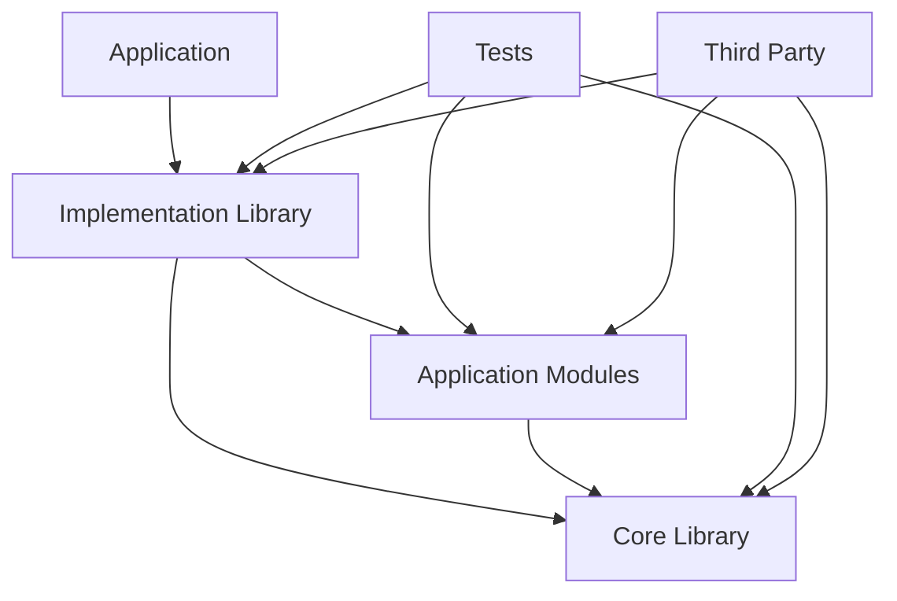

# Developer Guide

This guide provides comprehensive information for developers who want to extend, modify, or contribute to the cpp-template project. It covers the project architecture, coding standards, build system details, and best practices.

## Table of Contents

- [Project Architecture](#project-architecture)
- [Build System Overview](#build-system-overview)
- [Coding Standards](#coding-standards)
- [Adding New Components](#adding-new-components)
- [Dependency Management](#dependency-management)
- [Testing Guidelines](#testing-guidelines)
- [CMake Best Practices](#cmake-best-practices)
- [Contributing Guidelines](#contributing-guidelines)

## Project Architecture

### Directory Structure Philosophy

The project follows a hierarchical structure that promotes:

- **Separation of concerns**: Clear boundaries between different types of code
- **Modularity**: Components can be developed and tested independently
- **Reusability**: Libraries can be used across multiple applications
- **Maintainability**: Easy to locate and modify specific functionality

```
cpp-template/
├── include/           # Public API headers (what users see)
├── src/              # Application implementation
│   └── modules/      # Modular application components
├── libs/             # Internal project libraries
│   └── core/         # Fundamental functionality
├── tests/            # All test code
├── third_party/      # External dependencies
├── cmake/            # Build system modules
└── scripts/          # Development and build scripts
```

### Component Relationships



### Design Principles

1. **Interface Segregation**: Public headers in `include/` define clean APIs
2. **Dependency Inversion**: High-level modules don't depend on low-level modules
3. **Single Responsibility**: Each library/module has a focused purpose
4. **Open/Closed Principle**: Easy to extend without modifying existing code

## Build System Overview

### CMake Architecture

The build system uses modern CMake (3.20+) with target-based configuration:

- **Top-level CMakeLists.txt**: Global configuration and project setup
- **Component CMakeLists.txt**: Local configuration for each component
- **Custom modules**: Reusable CMake functions and utilities in `cmake/` directory
- **CMakePresets.json**: Predefined build configurations for different scenarios

### CMake Presets Configuration

The project uses CMakePresets.json for standardized build configurations:

```bash
# Default build (no vcpkg)
cmake --preset default
cmake --build build/default

# vcpkg build (Release)
cmake --preset vcpkg
cmake --build build/vcpkg

# vcpkg debug build
cmake --preset vcpkg-debug
cmake --build build/vcpkg-debug

# vcpkg with optional features
cmake --preset vcpkg-features
cmake --build build/vcpkg-features
```

### Key CMake Concepts Used

1. **Target-based approach**: All configuration attached to specific targets
2. **Generator expressions**: Platform and configuration-specific settings
3. **Interface libraries**: Header-only and dependency management
4. **vcpkg integration**: Automatic toolchain detection and configuration
5. **IPO/LTO**: Link-time optimization for Release builds
6. **Position Independent Code**: Enabled globally for security and compatibility

### Build Configuration Flow

1. **Project setup**: Version (0.0.2), C++17 standard, global settings
2. **Platform detection**: Windows, macOS (Intel/Apple Silicon), Linux configuration
3. **vcpkg integration**: Automatic toolchain detection and triplet selection
4. **Dependency resolution**: Find or download required libraries via vcpkg
5. **Target creation**: Libraries and executables with proper linking
6. **Compiler optimization**: IPO/LTO for Release, debug symbols for Debug
7. **Testing setup**: Google Test integration with CTest
8. **Installation**: Package for distribution with proper export targets

## Coding Standards

### C++ Standards

- **Language version**: C++17 (enforced via CMake)
- **Standard library**: Prefer standard library over third-party when possible
- **Modern features**: Use RAII, smart pointers, range-based loops, auto
- **Extensions**: Disabled (CMAKE_CXX_EXTENSIONS OFF)

### Code Formatting (.clang-format)

The project uses clang-format with Google style base and customizations:

```bash
# Format single file
clang-format -i src/file.cpp

# Format all source files
find . -name "*.cpp" -o -name "*.hpp" -o -name "*.h" | xargs clang-format -i
```

**Key formatting rules:**
- **Line length**: 100 characters
- **Indentation**: 4 spaces (no tabs)
- **Brace style**: Attach (Google style)
- **Pointer alignment**: Left (`int* ptr`)
- **Access modifiers**: -2 indent offset
- **Include sorting**: Case sensitive with preserved blocks

### Naming Conventions

```cpp
// Namespaces: lowercase with underscores
namespace cpp_template {
namespace core {

// Classes: PascalCase
class DataProcessor {
public:
    // Public methods: camelCase
    void processData();

    // Public members: camelCase (avoid public data)
    int getCount() const;

private:
    // Private members: camelCase with trailing underscore
    std::string data_;
    int count_;
};

// Functions: camelCase
void initializeSystem();

// Constants: UPPER_CASE
const int MAX_BUFFER_SIZE = 1024;

// Enums: PascalCase with PascalCase values
enum class ProcessingMode {
    Fast,
    Accurate,
    Balanced
};

} // namespace core
} // namespace cpp_template
```

### File Organization

```cpp
// header_file.h
#pragma once

#include <system_headers>
#include <third_party/headers>
#include "project/headers.h"

namespace cpp_template {

class ExampleClass {
public:
    // Public interface first
    ExampleClass();
    ~ExampleClass();

    // Copy/move operations
    ExampleClass(const ExampleClass&) = delete;
    ExampleClass& operator=(const ExampleClass&) = delete;
    ExampleClass(ExampleClass&&) = default;
    ExampleClass& operator=(ExampleClass&&) = default;

    // Main functionality
    void doSomething();

private:
    // Private implementation
    void helperFunction();

    // Data members last
    std::unique_ptr<Implementation> impl_;
};

} // namespace cpp_template
```

### Documentation Standards

```cpp
/**
 * @brief Brief description of the class or function
 *
 * Detailed description explaining the purpose, behavior, and usage.
 * Include examples when helpful.
 *
 * @param parameter_name Description of the parameter
 * @return Description of the return value
 * @throws ExceptionType When this exception is thrown
 *
 * @example
 * ```cpp
 * ExampleClass obj;
 * obj.doSomething();
 * ```
 */
void doSomething(int parameter_name);
```

## Adding New Components

### Adding a New Internal Library

1. **Create directory structure**:

   ```bash
   mkdir -p libs/newlib/{include/newlib,src}
   ```

2. **Create CMakeLists.txt**:

   ```cmake
   # libs/newlib/CMakeLists.txt
   add_library(newlib STATIC)

   target_sources(newlib
       PRIVATE
           src/newlib.cpp
       PUBLIC
           include/newlib/newlib.h
   )

   target_include_directories(newlib
       PUBLIC
           $<BUILD_INTERFACE:${CMAKE_CURRENT_SOURCE_DIR}/include>
           $<INSTALL_INTERFACE:include>
       PRIVATE
           ${CMAKE_CURRENT_SOURCE_DIR}/src
   )

   target_link_libraries(newlib
       PUBLIC
           core  # If it depends on core
   )

   # Apply compiler options
   if(COMMAND apply_compiler_options)
       apply_compiler_options(newlib)
   endif()

   # Create alias
   add_library(newlib::newlib ALIAS newlib)
   ```

3. **Update parent CMakeLists.txt**:

   ```cmake
   # libs/CMakeLists.txt
   add_subdirectory(core)
   add_subdirectory(newlib)  # Add this line
   ```

4. **Create public header**:

   ```cpp
   // libs/newlib/include/newlib/newlib.h
   #pragma once

   namespace cpp_template {
   namespace newlib {

   class NewLibrary {
   public:
       NewLibrary();
       ~NewLibrary();

       void doSomething();
   };

   } // namespace newlib
   } // namespace cpp_template
   ```

5. **Create implementation**:

   ```cpp
   // libs/newlib/src/newlib.cpp
   #include "newlib/newlib.h"

   namespace cpp_template {
   namespace newlib {

   NewLibrary::NewLibrary() = default;
   NewLibrary::~NewLibrary() = default;

   void NewLibrary::doSomething() {
       // Implementation
   }

   } // namespace newlib
   } // namespace cpp_template
   ```

### Adding a New Application Module

1. **Create module files**:

   ```bash
   touch src/modules/new_module.{h,cpp}
   ```

2. **Update modules CMakeLists.txt**:

   ```cmake
   # src/modules/CMakeLists.txt
   add_library(new-module STATIC
       new_module.cpp
   )

   target_include_directories(new-module
       PUBLIC
           ${CMAKE_CURRENT_SOURCE_DIR}
           ${CMAKE_SOURCE_DIR}/include
       PRIVATE
           ${CMAKE_SOURCE_DIR}/libs/core/include
   )

   target_link_libraries(new-module
       PUBLIC
           core
   )
   ```

3. **Link in main application**:

   ```cmake
   # src/CMakeLists.txt
   target_link_libraries(cpp-template-app
       PRIVATE
           cpp-template-impl
           data-processor
           config-manager
           new-module  # Add this line
   )
   ```

### Adding Tests for New Components

1. **Create test file**:

   ```cpp
   // tests/unit/newlib_test.cpp
   #include <gtest/gtest.h>
   #include "newlib/newlib.h"

   namespace cpp_template {
   namespace newlib {
   namespace test {

   class NewLibraryTest : public ::testing::Test {
   protected:
       void SetUp() override {
           library_ = std::make_unique<NewLibrary>();
       }

       void TearDown() override {
           library_.reset();
       }

       std::unique_ptr<NewLibrary> library_;
   };

   TEST_F(NewLibraryTest, BasicFunctionality) {
       ASSERT_NO_THROW(library_->doSomething());
   }

   } // namespace test
   } // namespace newlib
   } // namespace cpp_template
   ```

2. **Add test to CMakeLists.txt**:

   ```cmake
   # tests/unit/CMakeLists.txt
   add_cpp_template_test(newlib
       SOURCES newlib_test.cpp
       LIBRARIES newlib
   )
   ```

## Dependency Management

### Adding vcpkg Dependencies

The project uses vcpkg manifest mode with `vcpkg.json` for dependency management.

**Current dependencies:**
- `gtest`: Testing framework
- `fmt`: String formatting library
- `nlohmann-json`: JSON parsing
- `cpprestsdk`: REST API client (non-UWP platforms)

**Optional features:**
- `networking`: Adds curl and openssl
- `database`: Adds sqlite3 and postgresql

1. **Update vcpkg.json**:

   ```json
   {
     "dependencies": [
       "existing-dep",
       "new-dependency"
     ]
   }
   ```

2. **Use in CMake**:

   ```cmake
   find_package(NewDependency CONFIG REQUIRED)
   target_link_libraries(your_target PRIVATE NewDependency::NewDependency)
   ```

3. **Enable optional features**:

   ```bash
   cmake --preset vcpkg-features
   # Or set VCPKG_MANIFEST_FEATURES="networking;database"
   ```

**Version overrides:**
The project pins `fmt` to version 10.1.1 for stability.

### Adding System Dependencies

1. **Create find module** (if needed):

   ```cmake
   # cmake/FindNewDep.cmake
   find_path(NEWDEP_INCLUDE_DIR newdep.h)
   find_library(NEWDEP_LIBRARY newdep)

   include(FindPackageHandleStandardArgs)
   find_package_handle_standard_args(NewDep
       REQUIRED_VARS NEWDEP_LIBRARY NEWDEP_INCLUDE_DIR
   )

   if(NewDep_FOUND AND NOT TARGET NewDep::NewDep)
       add_library(NewDep::NewDep UNKNOWN IMPORTED)
       set_target_properties(NewDep::NewDep PROPERTIES
           IMPORTED_LOCATION "${NEWDEP_LIBRARY}"
           INTERFACE_INCLUDE_DIRECTORIES "${NEWDEP_INCLUDE_DIR}"
       )
   endif()
   ```

2. **Use in project**:

   ```cmake
   find_package(NewDep REQUIRED)
   target_link_libraries(your_target PRIVATE NewDep::NewDep)
   ```

### Adding Manual Dependencies

1. **Create directory structure**:

   ```bash
   mkdir -p third_party/manual/newdep/{include,src,lib}
   ```

2. **Add to manual CMakeLists.txt**:

   ```cmake
   # third_party/manual/CMakeLists.txt
   check_manual_dependency("NewDep" "newdep" NEWDEP_AVAILABLE)
   if(NEWDEP_AVAILABLE)
       create_header_only_target(manual_newdep
           "${CMAKE_CURRENT_SOURCE_DIR}/newdep/include"
       )
       add_library(third_party::newdep ALIAS manual_newdep)
   endif()
   ```

## Testing Guidelines

### Test Framework

The project uses **Google Test** with automatic discovery via CMake:

- **Framework**: Google Test (gtest) + Google Mock (gmock)
- **Discovery**: `gtest_discover_tests()` for automatic test registration
- **Execution**: CTest integration with parallel execution
- **Configuration**: 4 parallel jobs, 5-minute timeout

### Running Tests

```bash
# Build and run all tests
cmake --build build --target test

# Run tests with CTest
cd build && ctest

# Run tests with verbose output
cd build && ctest --verbose

# Run specific test
cd build && ctest -R "test_name"

# Run tests in parallel
cd build && ctest -j4
```

### Test Categories

1. **Unit Tests**: Test individual classes/functions in isolation
2. **Integration Tests**: Test component interactions
3. **Performance Tests**: Benchmark critical functionality
4. **System Tests**: End-to-end application testing

### Test Organization

```
tests/
├── unit/           # Unit tests for individual components
├── integration/    # Integration tests
├── performance/    # Performance benchmarks
└── CMakeLists.txt  # Test configuration
```

### Test Structure

```cpp
#include <gtest/gtest.h>
#include <gmock/gmock.h>
#include "component_under_test.h"

namespace cpp_template {
namespace component {
namespace test {

// Test fixture for shared setup/teardown
class ComponentTest : public ::testing::Test {
protected:
    void SetUp() override {
        // Common setup
    }

    void TearDown() override {
        // Common cleanup
    }

    // Shared test data
    ComponentUnderTest component_;
};

// Basic functionality test
TEST_F(ComponentTest, BasicOperation) {
    // Arrange
    auto input = createTestInput();

    // Act
    auto result = component_.process(input);

    // Assert
    EXPECT_EQ(expected_result, result);
}

// Error handling test
TEST_F(ComponentTest, HandlesInvalidInput) {
    auto invalid_input = createInvalidInput();

    EXPECT_THROW(component_.process(invalid_input), std::invalid_argument);
}

// Parameterized test for multiple inputs
class ComponentParameterizedTest : public ComponentTest,
                                  public ::testing::WithParamInterface<TestData> {
};

TEST_P(ComponentParameterizedTest, ProcessesVariousInputs) {
    auto test_data = GetParam();
    auto result = component_.process(test_data.input);
    EXPECT_EQ(test_data.expected_output, result);
}

INSTANTIATE_TEST_SUITE_P(
    VariousInputs,
    ComponentParameterizedTest,
    ::testing::Values(
        TestData{input1, output1},
        TestData{input2, output2}
    )
);

} // namespace test
} // namespace component
} // namespace cpp_template
```

### Mock Objects

```cpp
// Mock interface for testing
class MockDependency : public IDependency {
public:
    MOCK_METHOD(int, getValue, (), (override));
    MOCK_METHOD(void, setValue, (int value), (override));
    MOCK_METHOD(bool, isValid, (), (const, override));
};

// Using mocks in tests
TEST_F(ComponentTest, UsesMockDependency) {
    auto mock_dep = std::make_shared<MockDependency>();

    EXPECT_CALL(*mock_dep, getValue())
        .WillOnce(::testing::Return(42));

    component_.setDependency(mock_dep);
    auto result = component_.calculate();

    EXPECT_EQ(84, result);  // Assuming calculate() doubles the value
}
```

## CMake Best Practices

### Target-Based Configuration

```cmake
# Good: Target-based approach
add_library(mylib STATIC src/mylib.cpp)
target_include_directories(mylib PUBLIC include)
target_compile_features(mylib PUBLIC cxx_std_17)
target_link_libraries(mylib PUBLIC dependency::dependency)

# Avoid: Global variables
# set(CMAKE_CXX_STANDARD 17)  # Affects all targets
# include_directories(include)  # Global include
```

### Generator Expressions

```cmake
# Platform-specific configuration
target_compile_definitions(mylib PRIVATE
    $<$<PLATFORM_ID:Windows>:PLATFORM_WINDOWS=1>
    $<$<PLATFORM_ID:Linux>:PLATFORM_LINUX=1>
    $<$<PLATFORM_ID:Darwin>:PLATFORM_MACOS=1>
)

# Configuration-specific options
target_compile_options(mylib PRIVATE
    $<$<CONFIG:Debug>:-g -O0>
    $<$<CONFIG:Release>:-O3 -DNDEBUG>
)

# Compiler-specific flags
target_compile_options(mylib PRIVATE
    $<$<CXX_COMPILER_ID:GNU>:-Wall -Wextra>
    $<$<CXX_COMPILER_ID:MSVC>:/W4>
)
```

### Custom Functions

```cmake
# Reusable function for consistent target configuration
function(configure_cpp_target TARGET_NAME)
    target_compile_features(${TARGET_NAME} PUBLIC cxx_std_17)

    if(COMMAND apply_compiler_options)
        apply_compiler_options(${TARGET_NAME})
    endif()

    set_target_properties(${TARGET_NAME} PROPERTIES
        CXX_EXTENSIONS OFF
        POSITION_INDEPENDENT_CODE ON
    )
endfunction()

# Usage
add_library(mylib STATIC src/mylib.cpp)
configure_cpp_target(mylib)
```

## Contributing Guidelines

### Development Workflow

1. **Fork the repository**
2. **Set up development environment**: `./scripts/setup-dev-env.sh`
3. **Create a feature branch**: `git checkout -b feature/new-feature`
4. **Make changes** following coding standards
5. **Format code**: `clang-format -i modified_files.cpp`
6. **Add tests** for new functionality
7. **Build and test**: `cmake --preset vcpkg && cmake --build build/vcpkg --target test`
8. **Check code quality**: Ensure CI checks pass
9. **Update documentation** as needed
10. **Submit a pull request**

### Development Environment Setup

Use the provided setup script for your platform:

```bash
# Automated setup (macOS, Ubuntu, Fedora, Arch)
./scripts/setup-dev-env.sh

# Manual vcpkg setup
export VCPKG_ROOT=/path/to/vcpkg
cmake --preset vcpkg
```

### Continuous Integration

The project uses GitHub Actions for automated quality checks:

**Code Quality Workflow** (`.github/workflows/code-quality.yml`):
- **C++ Linting**: clang-format and clang-tidy analysis
- **CMake Formatting**: cmake-format validation
- **Static Analysis**: cppcheck integration
- **SARIF Upload**: Security analysis results
- **Multi-platform**: Ubuntu 24.04 with LLVM 17

**Quality Gates:**
- Code formatting compliance
- Static analysis warnings
- Build success across configurations
- Test execution and coverage

### Code Review Checklist

**Code Quality:**
- [ ] Code follows project coding standards (.clang-format)
- [ ] Static analysis warnings addressed (clang-tidy)
- [ ] No compiler warnings introduced
- [ ] Proper error handling and exception safety

**Testing:**
- [ ] All new functionality has unit tests
- [ ] Tests pass on all supported platforms
- [ ] Test coverage is adequate
- [ ] Integration tests added for new features

**Documentation:**
- [ ] Public APIs documented with Doxygen comments
- [ ] README.md updated if needed
- [ ] DEVELOPER_GUIDE.md updated for new patterns
- [ ] CHANGELOG.md updated

**Build System:**
- [ ] CMake configuration is correct
- [ ] vcpkg.json updated for new dependencies
- [ ] No unnecessary dependencies added
- [ ] Build works with all CMake presets

**Performance & Security:**
- [ ] Performance impact considered and measured
- [ ] Memory safety verified (RAII, smart pointers)
- [ ] No security vulnerabilities introduced

### Commit Message Format

The project follows the [Conventional Commits](https://www.conventionalcommits.org/) specification for commit messages:

```
type(scope): brief description

Detailed explanation of the change, including:
- What was changed and why
- Any breaking changes
- References to issues or tickets

Closes #123
```

**Conventional Commits Types:**
- `feat`: A new feature for the user
- `fix`: A bug fix for the user
- `docs`: Documentation changes
- `style`: Code style changes (formatting, missing semi colons, etc)
- `refactor`: Code refactoring without changing functionality
- `test`: Adding or updating tests
- `chore`: Maintenance tasks, dependency updates, build changes
- `perf`: Performance improvements
- `ci`: Changes to CI/CD configuration
- `build`: Changes to build system or external dependencies
- `revert`: Reverting a previous commit

**Breaking Changes:**
For breaking changes, add `!` after the type/scope: `feat!: remove deprecated API`

**Examples:**
```
feat(core): add data validation module
fix(build): resolve vcpkg dependency conflict
docs: update installation instructions
test(utils): add unit tests for string utilities
chore!: upgrade to C++20 standard
```

### Release Process

The project uses an automated release workflow triggered by Git tags. The process follows semantic versioning and Conventional Commits for changelog generation.

#### Automated Release Workflow

The release process is fully automated via GitHub Actions (`.github/workflows/release.yml`):

1. **Multi-platform builds**: Ubuntu 24.04, Windows 2022, macOS 14
2. **Package generation**: TGZ, ZIP, DEB, RPM, DMG, NSIS installers
3. **Automatic changelog**: Generated from commit history using Conventional Commits
4. **GitHub release creation**: With generated release notes and downloadable packages

#### Creating a Release

**Step 1: Prepare the release**
```bash
# Update version in CMakeLists.txt
sed -i 's/VERSION [0-9]\+\.[0-9]\+\.[0-9]\+/VERSION 1.2.3/' CMakeLists.txt

# Update version in vcpkg.json
sed -i 's/"version": "[0-9]\+\.[0-9]\+\.[0-9]\+"/"version": "1.2.3"/' vcpkg.json

# Commit version updates
git add CMakeLists.txt vcpkg.json
git commit -m "chore: bump version to 1.2.3"
```

**Step 2: Create and push the release tag**
```bash
# Create annotated tag following semantic versioning
git tag -a v1.2.3 -m "Release v1.2.3"

# Push the tag to trigger release workflow
git push origin v1.2.3
```

**Step 3: Monitor the release workflow**
- GitHub Actions will automatically build packages for all platforms
- Release will be created with generated changelog and downloadable assets
- Check the Actions tab for build status and logs

#### Release Workflow Features

**Build Matrix:**
- **Linux (Ubuntu 24.04)**: TGZ archive + DEB package
- **Windows (2022)**: ZIP archive + NSIS installer
- **macOS (14)**: TGZ archive + DMG disk image

**Quality Assurance:**
- Automated testing on all platforms
- Build artifact verification
- Package integrity checks
- Graceful handling of build failures

**Release Notes Generation:**
- Automatic changelog from git history
- Conventional Commits parsing
- Installation instructions for each platform
- Build status and package availability

#### Version Management

**Semantic Versioning:**
- `MAJOR.MINOR.PATCH` (e.g., `1.2.3`)
- Breaking changes: increment MAJOR
- New features: increment MINOR
- Bug fixes: increment PATCH

**Pre-release versions:**
```bash
# Alpha release
git tag -a v1.3.0-alpha.1 -m "Pre-release v1.3.0-alpha.1"

# Beta release
git tag -a v1.3.0-beta.1 -m "Pre-release v1.3.0-beta.1"

# Release candidate
git tag -a v1.3.0-rc.1 -m "Release candidate v1.3.0-rc.1"
```

#### Hotfix Process

For critical bug fixes:

```bash
# Create hotfix branch from main
git checkout -b hotfix/v1.2.4 main

# Make necessary fixes
git commit -m "fix(core): resolve critical security issue"

# Update version and create tag
git tag -a v1.2.4 -m "Hotfix v1.2.4"
git push origin v1.2.4
```

#### Troubleshooting Releases

**Build failures:**
- Check GitHub Actions logs for specific platform failures
- Build logs are automatically uploaded as artifacts
- Releases are created even with partial build failures

**Package verification:**
```bash
# Download and test packages locally
wget https://github.com/user/cpp-template/releases/download/v1.2.3/cpp-template-1.2.3-linux-x64.tar.gz
tar -xzf cpp-template-1.2.3-linux-x64.tar.gz
./cpp-template-1.2.3-linux-x64/bin/cpp-template-app --version
```

**Manual release creation:**
If automated workflow fails, create releases manually:
```bash
# Build locally
cmake --preset default
cmake --build build --config Release
cpack -G "TGZ;ZIP" -C Release

# Upload to GitHub release page
gh release create v1.2.3 build/cpp-template-*.tar.gz build/cpp-template-*.zip
```

This developer guide should be updated as the project evolves and new patterns emerge. For questions or clarifications, please open an issue or start a discussion.
